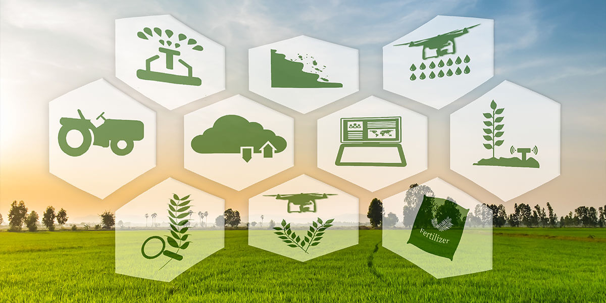

## EVOLUCIÓN AGRÍCOLA EN ESTADOS UNIDOS

Fuente: Liste Maquinaria

Este proyecto ha sido realizado como trabajo final del Máster de *Data Science* impartido por la escuela digital *KSchool*

## Propósito del proyecto
Estados Unidos es uno de los principales productores agrícolas a nivel global, especialmente en productos como la soja, maíz y algodón. Esto es posible gracias a las vastas extensiones de superficies agrícolas que pueden llegar a encontrarse y también a la diversidad de climas que están presentes en este país. 

A lo largo de la historia estas superficies agrícolas se han ido modificando. Actualmente el crecimiento de estas superficies no es una opción viable pero sí que lo es la modificación y adaptación de los cultivos influenciados por los nuevos factores a los que el sector agrario se enfrenta a día de hoy.

Algunos ejemplos de estos factores pueden ser: el cambio climático, introducción de nuevas tecnologías en la agricultura o las políticas que se han ido desarrollando a lo largo de los años.

Este trabajo está orientado al estudio de los factores climáticos y cuál ha sido la influencia en los cultivos agrícolas de Estados Unidos.

Una vez realizado el estudio, se ha visto que la evolución de las temperaturas a lo largo de las décadas sí que ha tenido influencia en la modificación y evolución de las superficies de los principales cultivos de EEUU mientras que la precipitación no ha sido una variable tan influyente, ya que esta puede ser sustituida por técnicas de riego. 

#### Autor: Alejandro Muñoz Molina
#### LinkedIn: https://www.linkedin.com/in/alex245/   